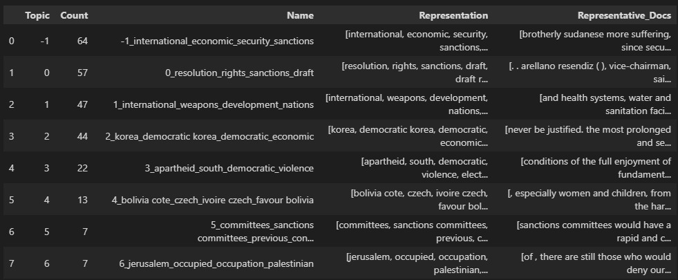
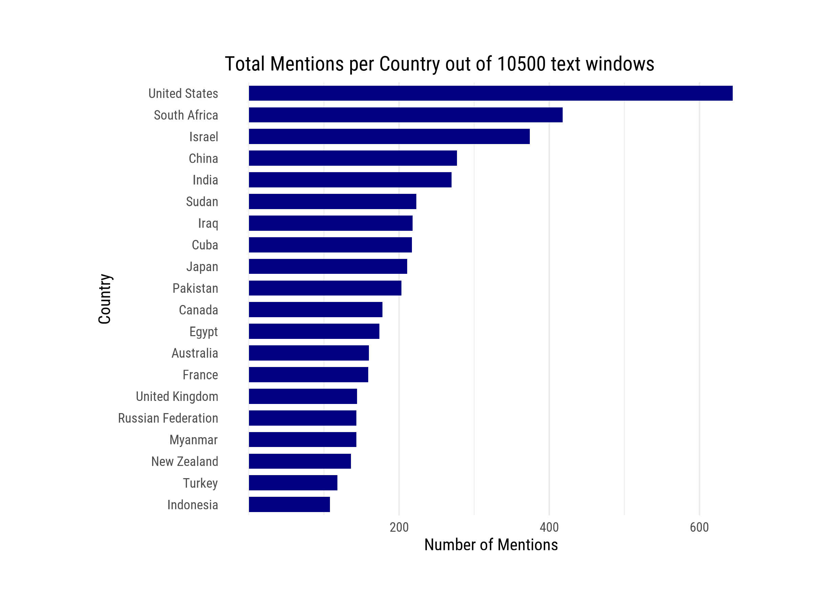
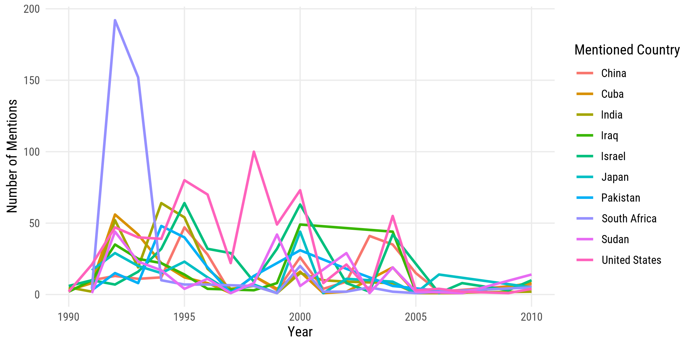
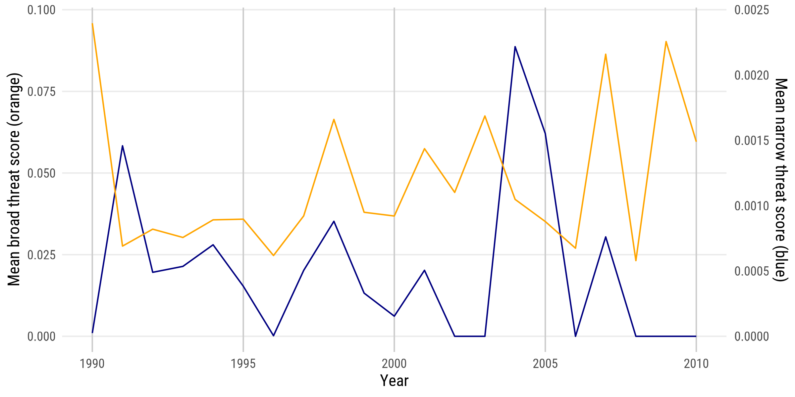
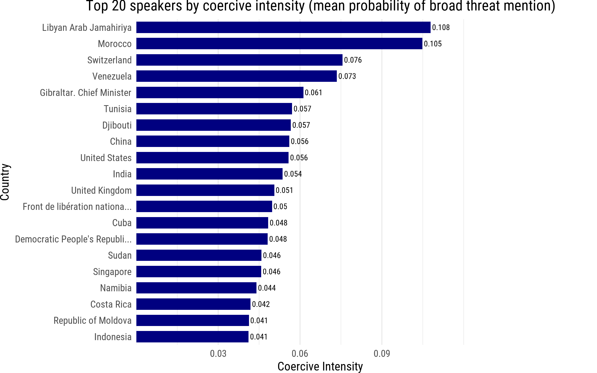
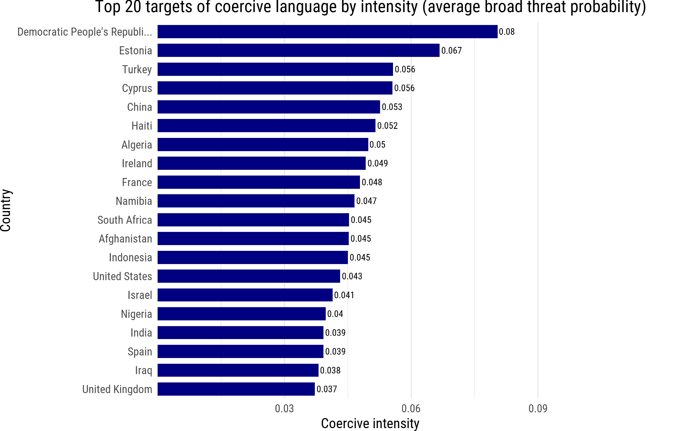
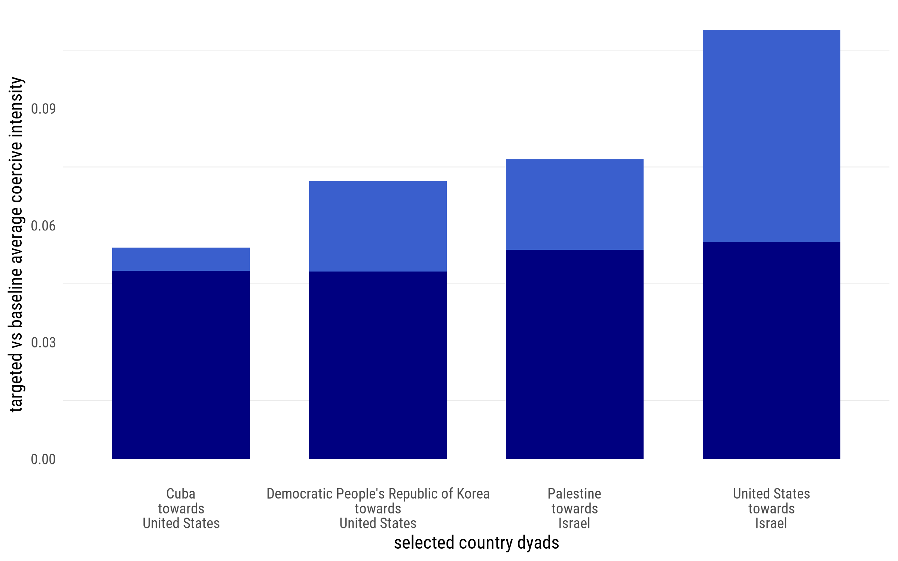

# Project at a glance
- **Project date:** Fall 2025 - Spring 2026

- **Research question:** How do you detect threatening language in a diplomatic setting? Which countries' representatives use threatening or coercive language in mentioning other countries, and how does this line up with geopolitical events?

- **Methodology:** Webscraping, text extraction from pdfs, text mining, topic modeling, zero shot classicification with customized entailment score modeling for threat detection

- **Programs used:** **R** (rvest, chromote for webscraping and text mining with **RegEx**), **Python** (text extraction, topic modeling, zero shot classification), **Github** (version control in group settings)

- **Output:** Aggregate statistics for coercive language use on country-level. Dataset of ~10500 mentions of countries and the sentences around them, scored on threatening, coercive and sanction-related language from up to 500 speeches per country-year in the period 1990-2010, subject to platform constraints.

- **Relevance:** I apply my knowledge of webscraping by finding a way to methodologically find data on UN speeches and automatically download the required speech notes. I then combine certain text-processing methods like RegEx rules, topic modeling with BERTopic and Zero Shot Classification (BART-facebook-mnli) for extracting and classifying text. This project highlights my familiarity with working with text data. 

## Scope
This project is a part of the research & policy seminar in Data Science and Machine Learning, where we were given free choice in project topics. Our group of three chose UN data because it grants us an opportunity to make a structural, informative dataset out of webscraped data. By using advance data science methods, we show how there is still opportunity to create useful data in an already data-driven world to fill research gaps. 

 

<strong>Methodology - Webscraping</strong>

1. Speech Record IDs
The webscraping begins by extracting record IDs from the JSON endpoints of the UN's digital library search page, looping over search pages by constructing links per country filter and per year. This was previously done with rvest directly from the search page, but the website was changed to load HTML in the back-end, which rendered rvest unuseable for this part. The output is a list of all revelant speech identifiers, each representing one speech made by one representative in a UN general member's assembly meeting.

2. Speech Metadata
We use the speech record IDs to construct new links, each leading to the speech's information page. From this page, we extract the relevant metadata, including the speaker's name, country that they represent, the date of the speech and importantly the meeting ID. This data is appended to the list of speeches, resulting in a metadata dataframe.

3. PDF Downloading
From the meeting ID, we build download links that automatically download each meeting pdf and save it in a folder. This results in 1045 pdfs from which the text can be extracted and coupled to one or more speeches.

 

<strong>Methodology - Text Extraction</strong>

1. Meeting text extraction from pdfs
We use the python package PyMuPDF to extract text out of all the pdfs, and append each full meeting text to the relevant speech. While it may not have been the most efficient solution to append each full meeting to each speech, as there are often multiple speeches in a meeting, it was not a time-consuming enough processing task to make a more dynamic solution preferable. 

2. Speech text extraction from meeting text
We return to R and use RegEx code to extract the relevant part of a speaker's speech out of the full meeting text. This is done by allowing for multiple patterns to start and end the text, which all involve the way the UN structures their speech notes, denoting the speakers name, optionally a text in brackets and then a colon. The pattern uses the relevant speaker's name from the metadata and matches the following examples for a speaker called "Smith" among others:
- Smith:
- Mr. Smith:
- Judge Smith (spoke in Spanish):
- Dr. Smith (United Kingdom) (spoke in Japanese):

We additionally normalize diacritics in our pattern matching code, so that examples like García (official speaker name) and Garcia (in UN meeting notes) will still get matched.

We find that this kind of pattern recognition gives us the most success with extracting speeches, while minimizing the false positives which would give us non-relevant text.

3. Country mention extraction from speech text
For each unique speech, we search for a mention of a country from a list of countries of the world, to extract mentions. We extract ~12000 mentions.

4. Context window extraction
For each mention, we take the two sentences around it, ending up with a context window. After deleting duplicates and non-relevant mentions (like lists of voting resolutions), we end up with ~10500 valid context windows.

 

<strong>Methodology - Analysis</strong>

For an exploratory analysis, we use topic modeling, which can be user unsupervised or weakly supervised by encoding text data into vectors, reducing dimensionality and then clustering texts with similar language together into groups, and assigning topics on them based on common words in that cluster.

We use BERTopic and make it weakly supervised (deleting filler words and adding a suggested coercive language keyword group) on a keyword-based subset of context windows, after which it finds a topic on sanctions, security and threats for 64 out of 200+ windows. While this is a fun exploratory analysis, it does not mean that the windows in this topics are necessarily about sanctions, coercing or contain threats. They just share the same language.

To detect threatening language, we use Zero Shot Clasification. This method uses a pretrained large language model to score our relevant context windows on a number of labels that have to do with threatening language or not. The labels can be seen as hypotheses, as it asks the model for each context window: "Does this text entail {Label_Threat}" Where Label_Threat is: "issuing or endorsing a threat, deterrent warning, or conditional punishment" for example. The entailment score can be seen as a model's relative confidence that the text entails the label. It is a score between 0 and 1, where a more threatening language would imply a higher score on the threat label, but possibly a lower score on a non-threat label like procedural or descriptive language. 

To filter out false positives, we construct a narrow threat score which takes the threat score and subtracts the best contender out of the non-threat labels, to arrive at a new threat score. It then only keeps these threat scores if there is a conditional (if, when, else, etc.) and a consequence (relat..., consequence, then, etc.) present in the context window. We also construct a broader threat score that only takes a wider view of threatening language and filters out procedural language. These two scores are called threat_narrow and threat_broad in the final results.

## Results - Mentions
The top 20 mentioned countries in the United Nations are shown below, beside the mentions over time for a few highly mentioned countries. Since our dataset spans 1990-2010, we can relate the amount of mentions to geopolitical events that were subject to discussion in the UN General Member's Assembly in this time period. This can explain the mentions of South Africa during the abolition of apartheid and Iraq between 2000 and 2003 during bombing and the US invasion. 

Please keep in mind that this aggregate total only consist of 600 UN speeches per year, of which some were and were not able to be scraped, downloaded or extracted, leaving only a subset of all total mentions.

## Results - Threat Detection
The first graph gives an overview of how our narrow and broad threats evolve over time in aggregate. As expected, the narrow threat score filters out more context windows, being a magnitude smaller than the mean broad threat score. This is expected, as generic and direct threats are decidedly rare in diplomatic settings.

The next graphs show the top 20 speakers and targets by and of coercive language. While some results may make sense in a geopolitical sense, such as North Korea being the biggest target, or Turkey and Cyprus being close to each other as their conflict was subject to discussion in this timeframe, the data should be interpreted carefully

We also select country dyads where one country uses decisively more threatening/coercive language to one target, relative to their average language. Some interesting results emerge from this, such as Cuba and North Korea to the United States, or Palestine towards Israel. One dyad that appears prominently is the United States-Israel pair, which should be interpreted as pressure-related rather than explicit threat language. However, this could be a noisy result - the model may have picked up on threatening language to any state that attacked Israel instead, and framed it as a threat towards Israel.

 

<strong>Selected Narrow Threats</strong>

The following are 4 hand-picked examples on our narrow-threat indicator. While even in the narrow threat data there are non-threat texts, these sprung out as either threats or vaguely coercive use of language that our model picked up on. Even when faced with the windows of text below, defining these as threats or not is not an easy task. The texts are heavily context-dependent, the language used is very diplomatic, where persuasion is framed in a positive way. The words are chosen carefully and not an expression of sudden emotion or sentiment. 

**Nepal to South Africa (textbook threat)**
"The South African people **cannot remain under the cruelty of apartheid any longer**. The international community, therefore, must continue to support the objectives and goals of the 1989 consensus Declaration, and lend political and moral support to the oppressed people of South Africa in their just struggle for liberation from apartheid oppression. At a time when the process towards dismantling apartheid through negotiations has reached a new and critical stage, **it is extremely important to continue to impose economic sanctions and a mandatory arms embargo** on the minority Pretoria regime as a means of **ensuring a speedy end to apartheid.**"

**Mali to Rwanda (less clean, impossible to know if threatening without further context)**
The tragedy of Rwanda, which does dishonour to the human race, **demands** for that reason that the international community seek a way to **implement solutions to ensure** that that country shall achieve **harmonious and definitive inter-ethnic coexistence.** Hence, Mali, which has a **military contingent** in Rwanda, suggests that Rwanda should receive substantial assistance from the international community. 

**Sudan on U.S. (very broad, no consequence stated)**
Yet this interest of ours must be met with an objective response by the other party. Hence, we call upon the United Nations and peace-loving countries to **urge the United States Administration** to take positive steps towards the **normalization of relations** with the Sudan and to **desist from interference in its internal affairs,** which only results in prolonging the civil war and death and suffering for the Sudanese people. 31 General Assembly 19th plenary meeting Fifty-fourth session 30 September 1999 The Sudan believes that the United States, as a great Power concerned with world and regional peace, could play an important role in the settlement of the Sudan's problems.

**Egypt on Israel (implicit language, framed positively)**
**If allowed to continue, it will only lead to** the proliferation of weapons of mass destruction in the region and could well carry the seeds of a **regional arms race, with all its grave consequences.** In this context, I wish to recall that last week the representative of Israel stated before the First Committee that Israel supports the principle of non-proliferation, recalling his country's vote in favour of the NPT in 1968 and its support for the indefinite extension of the Treaty. My delegation welcomes Israel's support for the principle of non-proliferation.

 

<strong>Limitations and Suggestions for Further Work</strong>

While the project shows how one can build a workflow that webscrapes, extract and analyze text data to build a novel dataset of label-classified text windows, it suffers from a number of drawbacks which may or not be inherent to our webscraping method. 

- Only a subset of 500 speeches per speaker country per year were extracted, due to limitations on the UN's search page (it does not allow for searching further than the 5th page, with 100 pages per result). Alternatives were considered, like looping over additional filters, but these were not applicable in our search setting.
- The subset of 500 speeches is non-random, but ordered on descending date, which means our speeches are all from the end of the year. This omits a non-random subset in each year, mostly in the months January-August. This may bias our results.
- UN meeting text pdfs were not always downloadable or the text was not always extractable. We did not consider more robust pdf download link construction in case of mismatched filenames or OCR for scanned pdf texts due to the considerable time costs.
- Speeches were not always succesfully extracted out of meeting texts or contained more text than just the speech. We implement a decently robust RegEx extraction process, but this could be improved further if made for more serious research.
- Other pretrained large language models besides BART-large-mnli might be more apt to use for detecting threatening or coercive language. We recommend testing DeBERTa-MNLI, trained on a broader mixture of inference datasets, which may better capture formal language.
- Other entailment scores might yield better results over ours. While we theorize that our scoring filters out false positives than a basic entailment score, removing the conditional and consequence gates might give more coercion examples that does not specifically contain a consequence, as diplomatic language rarely is so explicit.

## Final Thoughts
Besides the list of limitations above, the model we made has been able to cut down the number of irrelevant context windows drastically and shows just how efficiency-improving the usage of text processing can be for current manual workflows. I would suggest using this model to filter our large swats of irrelevant windows, whereafter manually going over the remaining windows to label them. This would be especially important in cases where language is implicit and framed in a well-prepared diplomatic way. 

As I would not want to encourage webscraping the UN digital library, only the files from text extraction to analysis are available upon request if interested, together with a sample dataset of a few meeting pdfs and corresponding metadata.

 

<strong>Workflow Setup</strong>

The diagram below visualizes our workflow. The code consists of two main files, from which all the other files that contain functions are run. Text extraction from pdfs and the analysis were best possible with python, which is why we opted for creating two main files, which build up on each other. All functions save data intermittently, so that progress can be stopped and started at command. This was needed, since runtimes for webscraping and threat analysis were very long. All data is saved under the data_files folder, and all code uses relative pathing to prevent any path conflicts when sharing code over github on different machines.

Seminar_UN_Final/

├─ scripts/

│  ├─ Config.R

│  ├─ Main_1_Data_Preparation.R

│  ├─ 1_Webscraping_Function_1_RecordID.R

│  ├─ 1_Webscraping_Function_2_Metadata.R

│  ├─ 1_Webscraping_Function_3_PDFs.R

│  ├─ 2_TextExtraction_Function_1_Text.py

│  ├─ 2_TextExtraction_Function_1_Text.R

│  ├─ 2_TextExtraction_Function_2_Speech.R

│  ├─ 2_TextExtraction_Function_3_Mentions.R

│  ├─ Main_2_Analysis.py

│  ├─ Analysis_3_Function_2_BERT.py

│  ├─ Analysis_3_Function_3_Threat_Streaming.py

│  └─ Analysis_3_Function_4_ThreatViz.py

│

├─ data_files/

│  ├─ pdfs/ ...

│  ├─ un_pdf_text.csv

│  ├─ un_speech_level_data.parquet

│  ├─ country_windows_sentences.parquet

│  └─ threat_data_dataset/ ...

│

└─ output/

   └─ threat_viz/ ...

